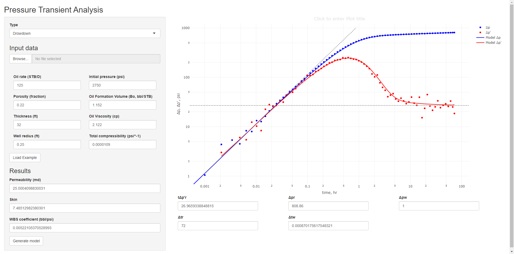

Pressure transient analysis
---------------------------

Starting a shiny application for PTA using the Tiab’s Direct Synthesis
technique (Manual parameter estimation using Log-Log Plot) for a
vertical well with constant WBS and skin in an infinity-acting
reservoir.

[PTA
webapp](https://chatosolutions.shinyapps.io/PTAwebapp/?_ga=2.253088457.1594544277.1607619484-1622287101.1605639564)

In this case we need a two columns dataset in .csv format, time in the
first column and well pressure in the second one, in hours and psia.

    ##        t     pwf
    ## 1 0.0000 2750.00
    ## 2 0.0010 2748.95
    ## 3 0.0021 2745.62
    ## 4 0.0034 2744.63
    ## 5 0.0048 2745.49
    ## 6 0.0064 2741.70

The app allows get permeability, skin and well storage coefficiente with
the following equations (1)

$$k = \\frac{70.6qB\\mu}{h(t\\Delta p')\_r} $$
$$ s = \\frac{1}{2}\\left\[\\frac{\\Delta p\_r}{(t\\Delta p')\_r}-ln\\left(\\frac{k\\Delta t\_r}{1688\\phi \\mu c\_t r\_w^2} \\right) \\right\]$$
$$ C = \\frac{qB\\Delta t\_w}{24\\Delta p\_w}$$
The plot has a horizontal line to fit IARF data of the derivative and a
unit-slope line to fit well storage data. After fit the IARG and WDS
lines we can generate de analytical model using the laplace transform
solutions to the diffusivity equation

Transform of the dimensionless wellbore pressure (2):

$$ \\overline{P\_{wD}}=\\frac{1}{u}\\left\[\\frac{K\_0(\\sqrt{u})+s\\sqrt{u}K\_1(\\sqrt{u})}{\\sqrt{u}K\_1(\\sqrt{u})+C\_Du\[K\_0(\\sqrt{u})+s\\sqrt{u}K\_1(\\sqrt{u}\])}\\right\]$$
Through the stehfest numerical inverse transformation method (1976), we
can calculate dimensionless wellbore pressure in real space. The Laplace
transform method can be given by (3)

$$ V(i) = (-1)^{\\frac{N}{2}+i}\\sum\_{k=\\frac{i+1}{2}}^{min\\left(i,\\frac{N}{2} \\right)} \\frac{k^\\frac{N}{2}(2k)!}{\\left(\\frac{N}{2}-k \\right)!(k)!(k-1)!(i-k)!(2k-i)!}$$
where
$$f(t) = \\frac{ln(2)}{t}\\sum\_{i=1}^{N}V(i)\\overline{f}(s)$$
$$s=i\\frac{ln(2)}{t}$$
The variable N could be one of the even numbers from 8 to 12. In this
case we use the *V*(*i*) with Stehfest parameter *N* = 8 from xxx

<table>
<thead>
<tr class="header">
<th style="text-align: center;"><em>V</em>(1)</th>
<th style="text-align: center;"><em>V</em>(2)</th>
<th style="text-align: center;"><em>V</em>(3)</th>
<th style="text-align: center;"><em>V</em>(4)</th>
<th style="text-align: center;"><em>V</em>(5)</th>
<th style="text-align: center;"><em>V</em>(6)</th>
<th style="text-align: center;"><em>V</em>(7)</th>
<th style="text-align: center;"><em>V</em>(8)</th>
</tr>
</thead>
<tbody>
<tr class="odd">
<td style="text-align: center;">-0.3333</td>
<td style="text-align: center;">48.3333</td>
<td style="text-align: center;">-906</td>
<td style="text-align: center;">5464.6667</td>
<td style="text-align: center;">-14376.66667</td>
<td style="text-align: center;">18730</td>
<td style="text-align: center;">-11946.6667</td>
<td style="text-align: center;">2986.6667</td>
</tr>
</tbody>
</table>

Reference

1.  Spivey, J. & Lee, J. (2013) Applied well test interpretation.
    Society of petroleum engineers
2.  Lee, John., Rollins, J. & Spivey, J. (2003)Pressure transient
    testing. Society of petroleum engineers
3.  Sun, H. (2015) Advanced Production Decline Analysis. Gulf
    Professional Publishing
