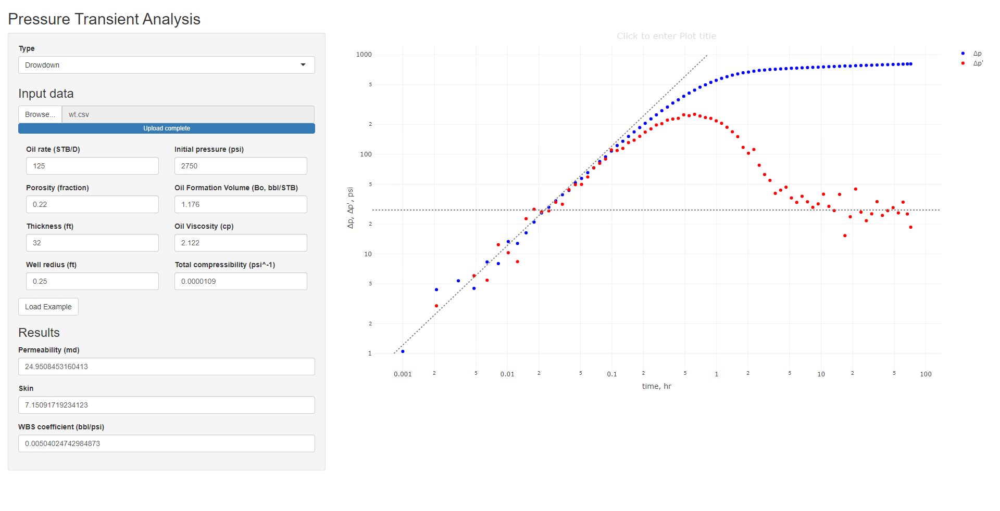

Pressure transient analysis
---------------------------

Starting an shiny application for PTA using the Tiab’s Direct Synthesis
technique (Manual parameter estimation using Log-Log Plot)

[PTA
webapp](https://chatosolutions.shinyapps.io/PTAwebapp/?_ga=2.253088457.1594544277.1607619484-1622287101.1605639564)

In this case we need a two columns dataset in .csv format, time in the
first column and well pressure in the second one, in hours and psia.

    ##        t     pwf
    ## 1 0.0000 2750.00
    ## 2 0.0010 2748.95
    ## 3 0.0021 2745.62
    ## 4 0.0034 2744.63
    ## 5 0.0048 2745.49
    ## 6 0.0064 2741.70

The app allows get permeability, skin and well storage coefficiente. The
plot has a horizontal line to fit IARF data of the derivative and a
unit-slope line to fit well storage data.
